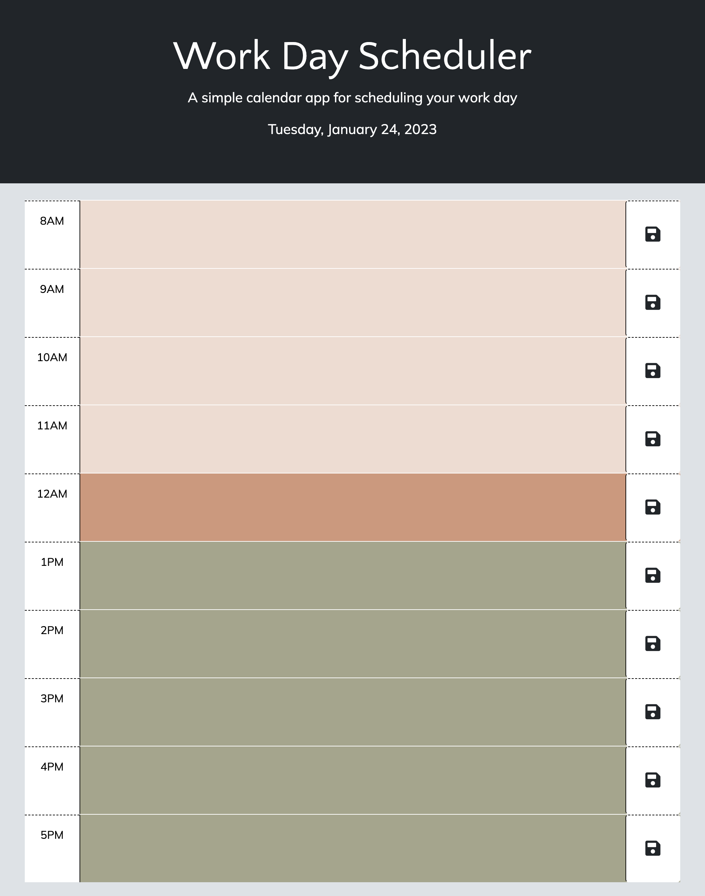

# Work Day Scheduler

## Description
[Work Day Scheduler](https://hannazo.github.io/stay-busy/) is a simple calendar application that allows a user to save events for each hour of the day.

It was built with HTML, CSS, JavaScript, jQuery and Bootstrap.  

Functionality:
- Current day is displayed at the top of the calendar when planner is opened
- Time blocks for standard business hours presented when scrolling down
- Color-coded time blocks indicate whether the block is in the past, present or future
- Enter event when click into a time block
- Save text in local storage when click the save button
- View saved events after refreshing the page

## Installation

No installation required. Simply click on the [link](https://hannazo.github.io/stay-busy/) to open the Work Day Scheduler page in the browser of your choice. 

## Usage

Open https://hannazo.github.io/stay-busy/  to access the Work Day Scheduler web page. Scroll through the page to see available time blocks. Input your information in relevant time fields. Don’t forget to click on the save button to be able to view your schedule after refreshing your browser. 

## License

N/A
